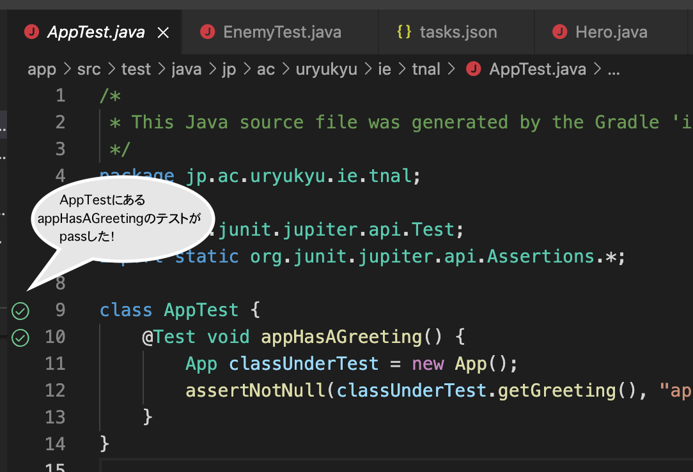
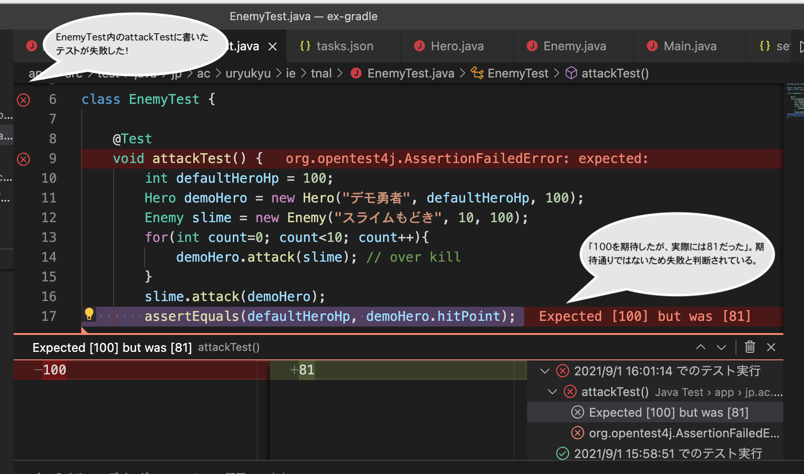

# Gradle + JUnit 5 入門
- 関連
  - [Gradle公式ガイド](https://docs.gradle.org/current/userguide/userguide.html)
    - [Gradle入門](https://qiita.com/vvakame/items/83366fbfa47562fafbf4)
  - [JUnit](https://junit.org/junit5/)
    - [JUnit 5 ユーザガイド](https://oohira.github.io/junit5-doc-jp/user-guide/)
    - [org.junit.jupiter.api.Assertions](https://junit.org/junit5/docs/current/api/org.junit.jupiter.api/org/junit/jupiter/api/Assertions.html)
  - Javadoc
    - [How to Write Doc Comments for the Javadoc Tool](https://www.oracle.com/technetwork/java/javase/documentation/index-137868.html#tag)
  - コード例
    - [Github:ex-gradle](https://github.com/naltoma/ex-gradle)
- ＜目次＞
  - <a href="#env">事前にやる環境構築</a>
  - <a href="#terms">用語説明</a>
  - <a href="#step1">step 1: 開発用ディレクトリの準備。</a>
  - <a href="#step2">step 2: Gradleの初期設定。</a>
  - <a href="#step3">step 3: Gradleの設定変更。</a>
  - <a href="#step4">step 4: コード編集等の開発。（今回はサンプルを用意）</a>
    - <a href="#step4-1">step 4-1: サンプルコードの用意。</a>
    - <a href="#step4-2">step 4-2: build.gradleの修正。</a>
    - <a href="#step4-3">step 4-3: VSCodeによる動作確認。</a>
    - <a href="#step4-4">step 4-4: Gradleの設定変更と動作確認。</a>
  - <a href="#step5">step 5: JUnit5のテストコード記述。</a>
  - <a href="#step6">step 6: Gradleによるテストの実行。</a>
    - <a href="#step6-1">step 6-1: VSCodeによるテストの実行。</a>
    - <a href="#step6-2">step 6-2: Gradleによるテストの実行。</a>
  - <a href="#step7">step 7: バージョン管理。</a>
  - <a href="#option1">おまけ1: Jarファイルの生成。</a>
  - <a href="#option2">おまけ2：JavaDocの生成。</a>

<hr>

## <a name="env">事前にやる環境構築</a>
- Gradle
  - ターミナルから ``brew install gradle`` を実行。
  - ``gradle --version`` と実行して ``Gradle 7.2`` 以上になってるならOK。古い人は更新（``brew upgrade gradle``）しておこう。
  - VSCode上でのGUIも使いたい人は、Extensionから ``Gradle Tasks`` もインストールしよう。授業では使いません。
- JUnit 5
  - 既にインストール済みを想定。何らかの理由で環境再構築が必要な人は下記を参照。
    - IntelliJ利用者は[2019年作成した資料](https://github.com/naltoma/java_intro/blob/master/IntelliJ%2BJUnit.md)を参考にしよう。
    - VSCode利用者は[VSCodeの環境構築](https://github.com/naltoma/java_intro2020/blob/master/VSCode-env.md)を参考に、``Extension Pack for Java`` をインストールしよう。
- 動作確認した環境情報: 2023/10/17
  - macOS 13.5.2
  - javac 17.0.8
  - gradle 8.4

<hr>

## <a name="terms">用語説明</a>
- Gradle とは
  - Gradleとはビルド・システム（build system）の一つである。ビルドシステムとは何かしら一連の手続きを整理・管理し、自動化するために用いることが多い。ここでいう一連の手続きとは、ソースコードをコンパイルしたり、テストしたり、ドキュメント生成したり、JARファイル生成したり、それらをカスタマイズしたりといったことを指す。簡易なシステムならその都度それらを手動で行っても問題ないが、主に複数人開発しているときにこれらを共通化（自動化）しておきたくなる。これらを自動化するためにGroovyと呼ばれる言語が用いられている。GroovyはJVM上で動作するため特別なインストールは不要である。
- JUnit 5 とは
  - JUnitとはJava専用の単体テストのためのフレームワークである。Pythonで触ったdoctestのようなものと考えてもらって構わない。これを利用するために、VSCodeの設定、Gradleの設定をした上でテストコードを書いていこう。
- JAR（Java ARchive; JARファイル）とは
  - .classや画像・音声等、多くの場合はプログラム実行時に必要となるファイル群をまとめてZIP形式で圧縮したもの。プログラム実行に限定されているわけではないため、ドキュメントなど任意のファイルを対象としても問題ない。
  - 参考: [java.util.jar](https://docs.oracle.com/en/java/javase/14/docs/api/java.base/java/util/jar/package-summary.html)

<hr>

## <a name="step1">step 1: 開発用ディレクトリの準備。</a>
- ゼロからの開発でも、開発途中のディレクトリに適用する場合でも Gradle を使う流れは同じである。ここでは途中まで開発しているコードが別途あるものとし、一旦何もないディレクトリを用意してそこにGradle初期設定を準備する。その後で別途用意したコードを移動してそれを実行できるように設定を変更するという流れでやってみよう。
- 以下は開発用ディレクトリを ``~/prog2/ex-gradle`` とし、空っぽのディレクトリを用意してから始める例を示している。

<hr>

## <a name="step2">step 2: Gradleの初期設定。</a>
- ターミナルで開発用ディレクトリに移動し、``gradle init`` を実行。
  - Gradleを利用するにはいくつか設定項目がある。ここでは以下のように設定している。
    - 開発対象種別: ``application``
    - 開発言語: ``Java``
    - プロジェクト数: ``no`` (複数サブプロジェクトを含まない)
    - ビルドスクリプトDSL: ``Kotlin``
      - 2022年度まではデフォルトで groovy が使われていましたが、2023年度10月現在は Kotlin になっています。
    - テストフレームワーク: ``JUnit Jupiter`` 　＊JUnit5のこと。
    - プロジェクト名: ``ex-gradle``　＊自身がわかれば何でも良い。ここではディレクトリ名がそのまま採用されている。
    - パッケージ名: ``jp.ac.uryukyu.ie.tnal``　　＊自身のアカウントに修正しよう。
    - Java version: default 21
    - Generate build using new APIs and behavior: （何も入力せずにEnter）
- 以下は git init した様子。

```shell
(base) oct2021:tnal% mkdir ex-gradle
(base) oct2021:tnal% cd ex-gradle/
(base) oct2021:tnal% gradle init

Select type of project to generate:
  1: basic
  2: application
  3: library
  4: Gradle plugin
Enter selection (default: basic) [1..4] 2

Select implementation language:
  1: C++
  2: Groovy
  3: Java
  4: Kotlin
  5: Scala
  6: Swift
Enter selection (default: Java) [1..6] 3

Generate multiple subprojects for application? (default: no) [yes, no] 
Select build script DSL:
  1: Kotlin
  2: Groovy
Enter selection (default: Kotlin) [1..2] 1  

Select test framework:
  1: JUnit 4
  2: TestNG
  3: Spock
  4: JUnit Jupiter
Enter selection (default: JUnit Jupiter) [1..4] 4

Project name (default: ex-gradle): 
Source package (default: ex.gradle): jp.ac.uryukyu.ie.tnal
Enter target version of Java (min. 7) (default: 21): 
Generate build using new APIs and behavior (some features may change in the next

> Task :init
To learn more about Gradle by exploring our Samples at https://docs.gradle.org/8.4/samples/sample_building_java_applications.html

BUILD SUCCESSFUL in 4m 26s
2 actionable tasks: 2 executed
(base) oct2021:tnal% tree
.
├── app
│   ├── build.gradle.kts
│   └── src
│       ├── main
│       │   ├── java
│       │   │   └── jp
│       │   │       └── ac
│       │   │           └── uryukyu
│       │   │               └── ie
│       │   │                   └── tnal
│       │   │                       └── App.java
│       │   └── resources
│       └── test
│           ├── java
│           │   └── jp
│           │       └── ac
│           │           └── uryukyu
│           │               └── ie
│           │                   └── tnal
│           │                       └── AppTest.java
│           └── resources
├── gradle
│   └── wrapper
│       ├── gradle-wrapper.jar
│       └── gradle-wrapper.properties
├── gradlew
├── gradlew.bat
└── settings.gradle.kts

21 directories, 8 files
```

- 補足
  - treeは階層構造を見やすく調整してくれるコマンド。``brew install tree``
  - **階層構造の違い** に注意。
    - VSCodeで直接 Java アプリケーションのプロジェクトを用意すると、「project名/src/package/ソースファイル」にソースファイルを保存していくことになる。
    - Gradleでは上記の通り ``project名/src/main/java/package/ソースファイル`` となる。テストコードは main を test にした階層に配置する。
    - 階層構造がGradle対応か否かで変わってくる。もし、非対応の既存プロジェクトをGradle対応にするなら、上記階層構造に変更する必要がある。
  - ``app/build.gradle.kts`` はGradle設定ファイル。後で修正する。
  - ``gradle/*, gradlew, gradlew.bat, settings.gradle`` もGradle関連ファイル。
  - これらとは別に、``ls -a`` を実行すると . から始まるファイルが見つかる。
    - ``.gitattributes``, ``.gitignore``: Git設定。Git利用時には中身を確認した上でaddしよう。
    - ``.gradle/``: Gradleが一時的に利用するためのディレクトリ。自動生成されるので無視して良い。Git管理対象にも指定(add)しない。

<hr>

## <a name="step3">step 3: Gradleの設定変更。</a>
- VSCodeで該当ディレクトリを開こう。
  - プロジェクトディレクトリ（~/prog2/ex-gradpe/）をVSCodeで開く。
- VSCodeで ``app/build.gradle.kts`` を開く。
  - case: 初めて開いたとき
    - ``Do you want to install the recommended 'Gradle for Java' extension from Microsoft for build.gradle.kts?`` と聞かれるので、指定された Extension (Gradle for Java) をインストールする。
- VSCodeで ``app/build.gradle.kts`` を開く。（Extensionインストール後）
  - 2箇所編集する。

### app/build.gradle.kts の編集1箇所目
sourceCompatibilityの設定。どのJDKから対応しているのかを明示するための設定。Javaに限らず多くのプログラミング言語は可能な範囲で後方互換性を保とうとするが、新版で追加された機能を用いたコードは古いJDKでは動作しない。今回は JDK 17 をインストールしていることを前提に設定しておこう。以下のコードを12行目以降に追記。少なくとも plugins を指定しているブロックの後ろに書こう。
```
java {                                      
    sourceCompatibility = JavaVersion.VERSION_17
}
```

### app/build.gradle.kts の編集2箇所目
2箇所目: JARファイル生成する際の設定。
- ファイルの最後尾に下記を追加して保存。
- パッケージ名は適宜修正すること。
```
tasks.withType<Jar> {
    manifest {
        attributes["Main-Class"] = "jp.ac.uryukyu.ie.tnal.App"
    }
}
```

### 動作確認
- 編集を保存して反映。
  - ファイル編集し終えたら保存しよう。保存するとJava classpath等の設定を同期するか確認されることがあるので、常にOKしたいなら ``Always``を選択。毎回確認したいなら``Now``を選択。
    - ``A build file was modified. Do you want to synchronize the Java classpath/configuration?``
  - もし同期確認をされず、設定反映されているか不安な場合には、保存後に vscodeを reload しよう。
    - コマンドパレットから reload と入力し ``Developer: Reload Window`` を選択。
- 動作確認。
  - case: ターミナルから実行する場合。プロジェクトディレクトリにて以下のコマンドを実行。
    - 通常実行: ``gradle run``
    - テスト実行: ``gradle test``
    - jarファイル生成: ``gradle jar``
    - jarファイルを使った実行: ``java -jar app/build/libs/app.jar``
    - 以下実行イメージ
```
(base) oct2021:tnal% pwd
/Users/tnal/prog2/ex-gradle
(base) oct2021:tnal% gradle run

> Task :app:run
Hello World!

BUILD SUCCESSFUL in 908ms
2 actionable tasks: 2 executed
(base) oct2021:tnal% gradle test

BUILD SUCCESSFUL in 1s
3 actionable tasks: 2 executed, 1 up-to-date
(base) oct2021:tnal% gradle jar

BUILD SUCCESSFUL in 382ms
2 actionable tasks: 1 executed, 1 up-to-date
(base) oct2021:tnal% java -jar app/build/libs/app.jar
Hello World!
```

- case: VSCodeから実行する場合。
  - 通常通り実行。
  - Note: gradle設定のキャッシュがどこかに残るのか、偶に実行できない（文法エラーが多数出る）ことがあります。この場合はファイルを開き直したり、reloadしてから改めて実行してみてください。

<hr>

## <a name="step4">step 4: コード編集等の開発。（今回はサンプルを用意）</a>
### <a name="step4-1">step 4-1: サンプルコードの用意。</a>
- コード概要
  - 「名前、HP、攻撃力」を持つHeroクラスとEnemyクラスを用意した。Mainクラスではこれらからオブジェクトを生成し、どちらかが倒れるまで攻撃し合う。
- コード配置
  - packageの外（``app/src/main/java/``）に置くコード
    - [Main.java](./src/hero_enemy/Main.java)
  - packageの中（``app/src/main/java/{package_directory}/``）に置くコード
    - [Hero.java](./src/hero_enemy/Hero.java)
    - [Enemy.java](./src/hero_enemy/Enemy.java)
- サンプルコードを用意する手順。
  - Hero.java, Enemy.java, Main.java の3つを適切に配置するために下記コマンドを実行しよう。**なお、mvコマンドではパッケージ名を指定してファイルを移動しているため、``tnal`` を ``自身のアカウント`` に修正して実行すること。**
    ```shell
    # ~/prog2/ex-gradle に移動し、
    # gradle init した後で実行することを想定。

    curl -O https://raw.githubusercontent.com/naltoma/java_intro2020/master/src/hero_enemy/Main.java
    mv Main.java app/src/main/java/
    curl -O https://raw.githubusercontent.com/naltoma/java_intro2020/master/src/hero_enemy/Hero.java
    mv Hero.java app/src/main/java/jp/ac/uryukyu/ie/tnal/
    curl -O https://raw.githubusercontent.com/naltoma/java_intro2020/master/src/hero_enemy/Enemy.java
    mv Enemy.java app/src/main/java/jp/ac/uryukyu/ie/tnal/
    ```
- 補足
  - packageは適宜修正すること。
  - コード配置後のディレクトリ構成は以下のようになっているはず。packageディレクトリは適宜読み替えること。

```shell
oct:tnal% pwd
/Users/tnal/prog2/ex-gradle

oct:tnal% tree app/src/main/

app/src/main/
├── java
│   ├── Main.java
│   └── jp
│       └── ac
│           └── uryukyu
│               └── ie
│                   └── tnal
│                       ├── App.java
│                       ├── Enemy.java
│                       └── Hero.java
└── resources
```

<hr>

### <a name="step4-2">step 4-2:build.gradle.kts の修正。</a>
- **注意**
  - 実行するファイルが ``jp.ac.uryukyu.ac.ie.App.java`` から、``Main.java`` に変わった。このことを Gradle に伝える必要がある。具体的にはbuild.gradleを以下のように編集する必要がある。
- build.gradleではmainメソッドを書いたクラスを指定する箇所がある。 **標準では ``package名.App`` が指定されているため、実行したいクラス（今回は新しく追加したMainクラス）を実行するように編集** しよう。
  - 1箇所目（applicationタスク内）
    - 旧: ``mainClass.set("jp.ac.uryukyu.ie.tnal.App")``
    - 新: ``mainClass.set("Main")``
  - 2箇所目（jarタスク内）
    - 旧: ``attributes["Main-Class"] = "jp.ac.uryukyu.ie.tnal.App"``
    - 新: ``attributes["Main-Class"] = "Main"``
- build.gradleの設定反映。
  - ファイル保存。
    - 編集しただけでは保存されていない。ちゃんと保存しよう。
  - 設定の反映。
    - 保存すると、設定を反映するかどうか確認されるので、NowもしくはAlwaysを選んで反映しよう。
    - もしくは、reloadでもOK。

<hr>

### <a name="step4-3">step 4-3: VSCodeによる動作確認。</a>
- Main.javaを開き、実行してみよう。
  - 一度目の実行では、Main.javaを置いているディレクトリ ``app/src/main/java`` がパスとして含まれていないため、パスに含めるかどうかを確認するウィンドウが表示されることがある。build.gradleで設定済みのため、``Skip`` を選ぼう。
  - 正しく動作するなら以下のような結果が出力されるはずだ。なお乱数を用いているため数値そのものは気にしなくて良い。

```shell
oct2021:tnal%  /usr/bin/env /Library/Java/JavaVirtualMachines/jdk-16.0.1.jdk/Contents/Home/bin/java -XX:+ShowCodeDetailsInExceptionMessages -Dfile.encoding=UTF-8 @/var/folders/nc/_3k6g05j2499x9n2cjtmhxl80000gn/T/cp_9zq9qkeqlj6uuiqt6se2ap17r.argfile Main
勇者のHPは10。攻撃力は5です。
スライムのHPは6。攻撃力は3です。
勇者 vs. スライム
1ターン目開始！
勇者の攻撃！スライムに0のダメージを与えた！！
スライムの攻撃！勇者に2のダメージを与えた！！
2ターン目開始！
勇者の攻撃！スライムに4のダメージを与えた！！
スライムの攻撃！勇者に0のダメージを与えた！！
3ターン目開始！
勇者の攻撃！スライムに3のダメージを与えた！！
モンスタースライムは倒れた。
スライムの攻撃！勇者に2のダメージを与えた！！
戦闘終了
oct2021:tnal%
```

<hr>

### <a name="step4-4">step 4-4: コマンドラインからの動作確認。</a>
- 動作確認
  - ターミナル上で ``gradle run``
  - 問題なければ VScode で実行したときと同じような結果が得られるはず。

<hr>

## <a name="step5">step 5: JUnit5のテストコード記述。</a>
- やりたいこと
  - Enemy.attack()のテストコードを記述してみよう。テスト内容は「倒れた後に攻撃できないこと」である。
  - 多くの場合、テストコードは「実行した結果が何かと等しくなることを検証する」「何かと等しくならないことを検証する」「処理結果が空であることを検証する」「処理結果が空ではないことを検証する」形で記述することが多い。
    - 等しいことを確認したいなら assertEquals。等しくないことを確認したいなら assertNotEquals を使おう。どういう検証用APIがあるかは本ページ上部の外部リンクを参照。
  - 今回は「倒れた後に攻撃できてしまうなら、相手のHPが元の数値から変わる（元のHPと等しくない）」ことを検証することにしよう。
- (a) EnemyTest.javaの作成。
  - gradle初期設定時に ``src/test/package名/AppTest.java`` がテンプレートとして生成されているはず。このAppTest.javaを複製して、``src/test/package名/EnemyTest.java`` として用意しよう。
  - なおファイル名は「クラス名Test.java」とすることが一般的である。こうすることでどのクラスに対するテストかを判別しやすくなる。
- (b) ファイルの編集。
  - クラス名の修正。
    - EnemyTest.javaに即したクラス名に修正しよう。
  - メソッドの修正。
    - ``@Test void appHasAGreeting()`` はコード例なので、ブロックごと削除しよう。
    - 代わりに、以下のコードを追記。やってることは以下の通り。
      - ヒーローと敵を準備。
      - ヒーローの攻撃力を高め、かつ、複数回連続で敵を殴り続けることで必ず倒しておく状況をつくる。
      - 敵を倒した後で、敵の攻撃メソッドを実行してみる。既に倒れている状態なら攻撃メソッドを呼び出しても実行できず、ヒーローのHPは減らない（変わらない）はず。このことを assertEquals で検証しよう。
- 補足
  - ``@アノテーション (@ annotation)`` について。
    - アノテーション自体は何かしらの目印を意味する。JDKにおける ``@Test`` は、テストコードが記述されたメソッドであることを明示している。これが記載されているメソッドは後述の「検証」実行時に自動的に実行される。

```Java
package jp.ac.uryukyu.ie.tnal;

import org.junit.jupiter.api.Test;
import static org.junit.jupiter.api.Assertions.*;

class EnemyTest {
    @Test
    void attackTest() {
        int defaultHeroHp = 100;
        Hero demoHero = new Hero("デモ勇者", defaultHeroHp, 100);
        Enemy slime = new Enemy("スライムもどき", 10, 100);
        for(int count=0; count<10; count++){
            demoHero.attack(slime); // over kill
        }
        slime.attack(demoHero);
        assertEquals(defaultHeroHp, demoHero.hitPoint);
    }
}
```

<hr>

## <a name="step6">step 6: テストの実行。</a>
### <a name="step6-1">step 6-1: VSCodeによるテストの実行。</a>
VSCode上からは、基本的にはファイル単位でのテスト実行が可能。
- (1) テスト実行したいファイルを開く。
- (2) 左パネルのファイル名を選択し、``Ctrl + クリック`` でサブメニューを出す。そこから ``Run Java`` を選択して実行。
  - ファイル内のテストが成功すると、クラス名やメソッド名がある行番号のところに緑色でチェックが付く。これがテストが通った（passした）という意味。
    - AppTest.javaで確認してみよう。
    - 
  - ファイル内のテストが失敗すると、クラス名やメソッド名がある行番号に赤色でXが付き、失敗した箇所が強調表示される。
    - 今回用意した EnemyTest.java で確認してみよう。
    - 

<hr>

### <a name="step6-2">step 6-2: Gradleによるテストの実行。</a>
VSCode上からはファイル単位での実行になるが、Gradleを通せば「@Test」アノテーションが付いているテストを自動で探し出し、全てのテストをまとめて実行することができる。
- (1) ターミナルから ``gradle test`` する。もしくは ``gradle test --info`` すると、詳細結果を確認できる。
  - 以下のような結果が得られるはずだ。重要な点は2つ。
  - (1) 実行したテスト数とその結果。
    - ``2 tests completed, 1 failed`` とあり、2つ実行、1つ失敗と報告している。
  - (2) 何箇所かに ``failed`` という単語が出てきており、何かしら検証が失敗したことを示している。
    - 具体的な箇所は ``EnemyTest > attackTest() FAILED`` とある。
  - (3) より詳細を知りたい人向けに ``There were failing tests. See the report at: file:///Users/tnal/prog2/ex-gradle/app/build/reports/tests/test/index.html`` と書かれており、どうやら詳細報告書がHTML形式で出力されている。必要に応じてこれを参照するとより中身を確認しやすくなる。確認したい場合にはターミナルから ``open app/build/reports/tests/test/index.html`` と実行しよう。

```shell
oct:tnal% gradle test


> Task :app:test FAILED

EnemyTest > attackTest() FAILED
    org.opentest4j.AssertionFailedError at EnemyTest.java:17

2 tests completed, 1 failed

FAILURE: Build failed with an exception.

* What went wrong:
Execution failed for task ':app:test'.
> There were failing tests. See the report at: file:///Users/tnal/vscode/ex-gradle/app/build/reports/tests/test/index.html

* Try:
Run with --stacktrace option to get the stack trace. Run with --info or --debug option to get more log output. Run with --scan to get full insights.

* Get more help at https://help.gradle.org

BUILD FAILED in 2s
3 actionable tasks: 2 executed, 1 up-to-date
```

<hr>

## <a name="step7">step 7: バージョン管理。</a>
- この時点までのコードと設定ファイルをGit管理し、GitHubに登録しよう。
  - GitHubリポジトリ名：``ex-gradle``　＊それ以外でも良いけど。
  - jarファイル, htmlファイル等の自動生成されるファイルはaddしないこと。（デフォルトでもaddしないように設定されています）
- 手順
  - ローカルディレクトリをGit管理下にする。
    - ``git init``
  - これ以降は[Git + GitHub 演習](https://github.com/naltoma/java_intro2020/blob/master/GitHub_intro.md)のstep2〜step7を参考にやってみよう。
- うまくやれていれば、次のように登録されているはず。
  - [Github:ex-gradle](https://github.com/naltoma/ex-gradle)
  - なお、上記リンク先は古いGradleでの例です。現バージョンでは存在しないファイルも含まれています。今回は皆さん自身の手元にあるファイルで、.gitignore で除外指定されているものを除いた全てのファイルがアップロードされていればOK。

<hr>

## <a name="option1">おまけ1: Jarファイルの生成。</a>
- ターミナルから ``gradle jar``
  - 問題なければjarファイルが ``app/build/libs/app.jar`` として保存されている。これを次のように実行しよう。
- ``java -jar app/build/libs/app.jar``
  - 問題なければ VScode で実行したときと同じような結果が得られるはず。実行させたいクラスを指定したjarファイルは、このように実行可能。アプリケーションとして配布したい場合にはjarファイルを配布すると良い。

<hr>

## <a name="option2">おまけ2：JavaDocの生成。</a>
- ターミナルから ``gradle javadoc``
  - **警告:コメントなし** という指摘が多数報告される。これはJavaDoc形式に基づいたコメントを記載すべき場所に記載されていないという報告である。今は無視しよう。
  - 上記以外に問題なければHTML形式のドキュメントが ``app/build/docs/javadoc/`` 以下に保存されている。これを次のように閲覧してみよう。
- ``open app/build/docs/javadoc/index.html``
- JavaDoc形式の補足
  - コンストラクタ ``Hero.Hero()`` や、メソッド ``Hero.attack()`` のドキュメントと、ソースコードを比較してみよう。コードのどの部分がドキュメントとして抽出されているだろうか。
- JavaDoc形式ドキュメントの書き方
  - ドキュメント例: [TicTacToe.java](https://github.com/naltoma/java_intro/blob/master/TicTacToe/TicTacToe.java)
    - クラスについて説明を書くなら「クラスの直前」に、指定書式で書く。
    - メソッドや変数についても各場所は同様に「直前」に書く。
- **クラス・フィールド変数・コンストラクタ・メソッドの前に、下記書式でコメントを書く。**
  - 必ず ``/**`` という行から書き始めること。javadoc はこの行を参考にドキュメントを生成する。（``//``で書いたコメントは無視される）
- **よく見る（使われる）アノテーション**
  - @author @version クラス・インタフェース専用
  - @param パラメータ
  - @return 戻り値
  - @exception 例外
  - @see 関連するクラス、メソッド等を列挙。もしくは外部ページ等の参照情報
  - @deprecated 非推奨（「近い将来削除等の理由で使えなくなる」ということを明示するためのオプション）
  - その他: [How to Write Doc Comments for the Javadoc Tool](https://www.oracle.com/technetwork/java/javase/documentation/index-137868.html#tag)

```
/**
* 1行目: 1行コメント。
* 2行目以降: 複数行コメント。（省略可）
* パラメータ・戻り値等については、以下のようにアノテーション付きで記述。
* @param a 足したい値
* @param b 足したい値
* @return 足した結果
*/
public int add(int a, int b){
  return a + b;
}
```
