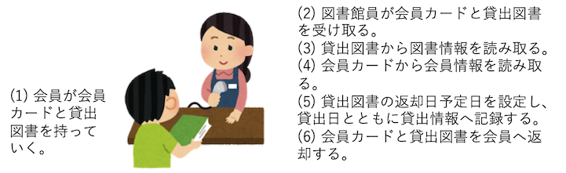

# オブジェクト指向型プログラミング（導入編）
- 教科書関連箇所
  - 7章の7.1節〜7.4節。（7.5節は一旦スキップ）
  - 8章の8.1節〜8.4節。
  - 9章の9.1節〜9.2節。
- ＜目次＞
  - <a href="#paradaim">手続き型プログラミング vs オブジェクト指向型プログラミング</a>
  - <a href="#example">実例：図書館における貸出業務</a>
  - <a href="#step1">ステップ1：貸出図書クラスの設計＆実装例</a>
  - <a href="#step2">ステップ2：会員クラスの設計＆実装例</a>
  - <a href="#step3">ステップ3：貸出情報クラスの設計＆実装例</a>

<hr>

## <a name="paradaim">手続き型プログラミング vs オブジェクト指向型プログラミング</a>
- プログラムを書いていく考え方として、手続き型プログラミングとオブジェクト指向型プログラミングという考え方がある。
  - 前期の「プログラミング1」では手続き型プログラミングでコードを書いた。手続き型プログラミングとは、コンピュータがどのように動けばよいかという **手続き（手順やレシピ）** を中心に見据え、手続きを先頭から順番に命令として記述していく方法。これは考え方であって言語ではない点に注意しよう。例えば手続き型プログラミングの考え方でPythonのプログラムも書けるし、Javaのプログラムも、それ以外の言語でも記述することができる。
  - オブジェクト指向型プログラミングでは、**オブジェクト（何かしら動作する主体）** を中心に見据え、そのオブジェクトの振る舞いを捉える形で設計する方法。
    - 参考: [オブジェクト](https://eow.alc.co.jp/search?q=object)
      - ``〔視覚や触覚で感知できる〕物、物体``
      - ``〔関心や意識などの〕中心、焦点``
      - ``〔動作や行為の〕目的、目標``
      - ``オブジェクト指向プログラミングにおける、変数、データ構造、手続きが一体になったもの。``
    - 参考: [Object-oriented programming](https://en.wikipedia.org/wiki/Object-oriented_programming)
      - ``Objects sometimes correspond to things found in the real world. For example, a graphics program may have objects such as "circle", "square", "menu". An online shopping system might have objects such as "shopping cart", "customer", and "product".``
    - 設計のイメージ
      - 教科書, 7.3.2節, pp.283-284
- オブジェクト指向型プログラミングがベストというわけではない。
  - 世の中に手続き型プログラミングもオブジェクト指向型プログラミングもそれらを解説した書籍は多数あるが、どちらが良いとかベストとかいう話ではない。これら以外にも「実現したい事柄をどのように設計に落とし込み、言語により記述するか」についてのアプローチは多数ある。代表的な考え方であるからにはそれなりの利点があるため、それを学ぼうというのが授業「プログラミング2」の趣旨。

<hr>

## <a name="example">実例：図書館における貸出業務</a>
- 対象：図書館における貸出業務。
  - [](./figs/object_oriented_example_library.png)
  - クラス例
    - 会員
    - 貸出図書
    - 貸出情報
- 実装方針
  - クラス設計は package 指定する。
    - 今回は「jp.ac.uryukyu.ac.jp.tnal」に「library」を加えることにする。理由は後述。
  - クラスを用いてオブジェクトを生成し、具体的に貸し出し処理を行う部分は ``src/Main.java`` で行う。
  - このようにソースコード配置を分けている理由。
    - 貸出業務自体は現実世界における具体的な業務である。これに対し、会員クラス・貸出図書クラス・貸出情報クラスといった **クラス** は設計図であり、抽象化された情報である。設計図はどの図書館であっても利用できる。この部分を「 図書館package」してまとめておくことで責任を明確にできたり、再利用しやすくなるといった利点がある。
- 想定ファイル配置

```
src/Main.java
src/jp/ac/uryukyu/ie/tnal/library/Member.java
src/jp/ac/uryukyu/ie/tnal/library/RentalBook.java
src/jp/ac/uryukyu/ie/tnal/library/RentalLog.java
```

<hr>

## <a name="step1">ステップ1：貸出図書クラスの設計＆実装例</a>
- クラス名: RentalBook
  - タイトル: String title;
  - バーコード: int barcode;
- コード例1

```Java
// RentalBook.java
package jp.ac.uryukyu.ie.tnal.library;

public class RentalBook {
    // フィールド（クラス変数）
    public String title;
    public int barcode;

    // コンストラクタ
    public RentalBook(String _title, int _barcode){
        this.title = _title;
        this.barcode = _barcode;
    }

    // staticなしメソッド例
    public void printSummary(){
        System.out.println("title =" + this.title + ", barcode = " + this.barcode);
    }
}

// --------------------

// Main.java (ver.1)
import jp.ac.uryukyu.ie.tnal.library.*;

public class Main {
    public static void main(String[] args){
        //貸し出し図書の準備
        RentalBook book1 = new RentalBook("何故ルートビアは美味いのか", 123);
        System.out.println(book1.title);
        book1.printSummary();
    }    
}
```

- 補足説明
  - クラスとオブジェクト
    - クラス(class)とは、オブジェクト(object)の設計図である。原則として、設計図はそのままでは利用（実行）できない。
    - オブジェクトとは、クラスに基づいて生成した実体（インスタンス(instance)とも呼ばれる）である。
  - フィールド
    - フィールド(field)とは、クラスが持つ変数のこと。今回の例だと ``RentalBook.title`` や ``RentalBook.barcode`` のこと。他のクラスを変数として持つことも可能。
  - コンストラクタ
    - コンストラクタ(constructor)とは、クラスからオブジェクト生成する際に自動実行させたい処理をまとめたもの。今回の例では ``RentalBook.RentalBook()`` のこと。自動処理が不要な場合にはコンストラクタを省略しても構わない。
    - 生成時のみしか利用できない点に注意。
    - メソッドではないし、戻り値も設定できない。戻り値は「クラスに基づいて生成したオブジェクト」となる。
    - thisは後述。
  - オブジェクトの生成
    - ``クラス名 変数名 = new クラス名();`` という書式で生成する。引数が必要なコンストラクタを利用する場合には、カッコ内に引数を指定して記述することになる。new演算子により、指定されたクラスのコンストラクタが呼び出されてオブジェクトが生成され、そのオブジェクトを変数に保存することができる。
    - ``this``
      - クラス内でのみ利用することができる変数名。「自分自身のオブジェクト」を意味する。オブジェクト自身のフィールドを参照する際に用いる。今回の例では、``new RentalBook("何故ルートビアは美味いのか", 123) で生成されたオブジェクト`` のことを意味しており、``this.title`` で「その生成されたオブジェクト自身のtitle」に、コンストラクタで指定された _title の中身を保存している。
      - 一度保存したフィールドは、このオブジェクトが破棄されるまでは保存した状態で利用できる。printSummary() メソッドでは this.title, this.barcode という指定で「自分自身のオブジェクトが持っているフィールドtitle, barcode」を参照している。
  - クラスメンバ（フィールド、メソッド）の利用。
    - new演算子により生成されたオブジェクトが持つデータや処理のことをクラスメンバと呼ぶ。**コンストラクタは含まない** ことに注意。
    - 前述した通りフィールド（title, barcode）とメソッド（printSummary()）は、設計図として書かれたクラスのままでは利用できない。コンストラクタにより生成したオブジェクトを通して利用することができる。この様子を示したものが Main.main() のコードである。
      - 1行目: new演算子によりオブジェクトを生成し、book1へ保存。
      - 2行目: book1にはオブジェクトが保存されており、そのオブジェクトが持つフィールドtitleを参照し、出力。
      - 3行目: book1にはオブジェクトが保存されており、そのオブジェクトが持つメソッド printSummary() を呼び出し、実行。

<hr>

## <a name="step2">ステップ2：会員クラスの設計＆実装例</a>
- クラス名: Member
  - 会員番号: int id;
  - 氏名: String name;
- コード例2

```Java
// Member.java
package jp.ac.uryukyu.ie.tnal.library;

public class Member {
    int id;
    String name;

    public Member(int _id, String _name){
        this.id = _id;
        this.name = _name;
    }

    public String getName(){
        return this.name;
    }
}

// --------------------

// Main.java (ver.2)
import jp.ac.uryukyu.ie.tnal.library.*;

public class Main {
    public static void main(String[] args){
        //貸し出し図書の準備
        RentalBook book1 = new RentalBook("何故ルートビアは美味いのか", 123);
        System.out.println(book1.title);
        book1.printSummary();

        //顧客の準備
        Member teacher = new Member(945734, "naltoma");
        System.out.println(teacher.getName());
    }    
}
```

<hr>

## <a name="step3">ステップ3：貸出情報クラスの設計＆実装例</a>
- クラス名: RentalLog
  - 会員: Member member
  - 貸出図書: RentalBook book
  - 貸出日: Calendar rentalBegin;
    - 参考: [java.util.Calender](https://docs.oracle.com/en/java/javase/14/docs/api/java.base/java/util/Calendar.html)
  - 返却予定日: Calendar rentalEndPlan;
  - 返却フラグ: boolean returned;
- コード例3

```Java
// RentalLog.java
package jp.ac.uryukyu.ie.tnal.library;

import java.util.Calendar;

public class RentalLog {
    Member member;
    RentalBook book;
    Calendar rentalBegin;
    Calendar rentalEndPlan;
    boolean returned;

    public RentalLog(Member _member, RentalBook _book){
        this.member = _member;
        this.book = _book;
        this.rentalBegin = Calendar.getInstance();
        this.rentalEndPlan = Calendar.getInstance();
        this.rentalEndPlan.add(Calendar.DATE, 7); //1週間後
        this.returned = false;
    }

    public void getRentalEndPlan(){
        int year = this.rentalEndPlan.get(Calendar.YEAR);

        // 月については、1月を0番目と数えているので+1して利用。
        int month = this.rentalEndPlan.get(Calendar.MONTH) + 1;
        int date = this.rentalEndPlan.get(Calendar.DATE);
        System.out.printf("%d年%d月%d日までに返却ください。\n",year,month,date);
    }
}

// --------------------

// Main.java (ver.3)
import jp.ac.uryukyu.ie.tnal.library.*;

public class Main {
    public static void main(String[] args){
        //貸し出し図書の準備
        RentalBook book1 = new RentalBook("何故ルートビアは美味いのか", 123);
        System.out.println(book1.title);
        book1.printSummary();

        //顧客の準備
        Member teacher = new Member(945734, "naltoma");
        System.out.println(teacher.getName());

        //貸出の例
        RentalLog log = new RentalLog(teacher, book1);
        log.getRentalEndPlan();
    }    
}
```
