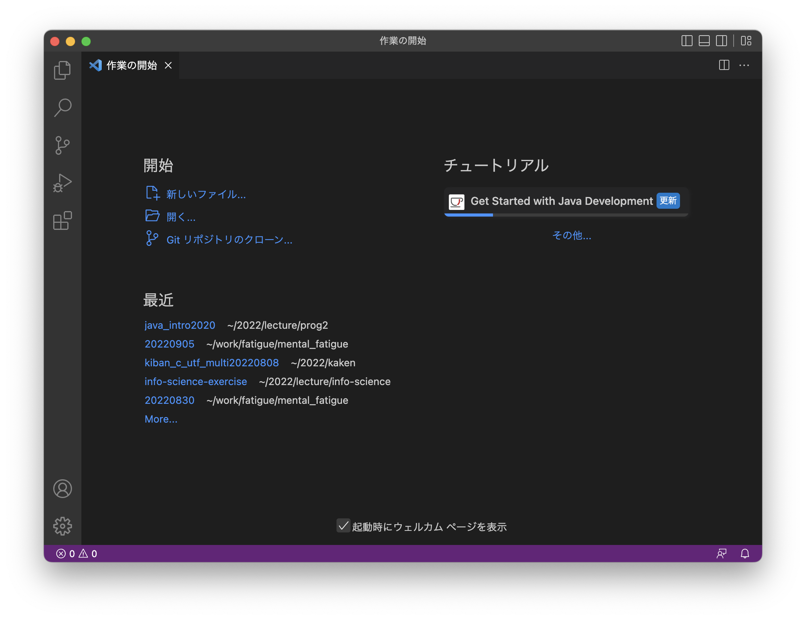
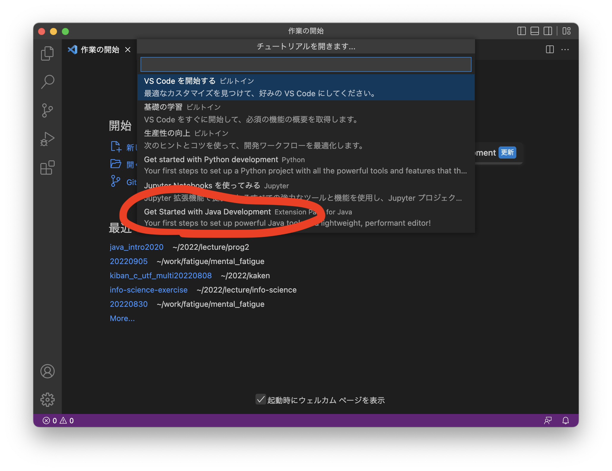
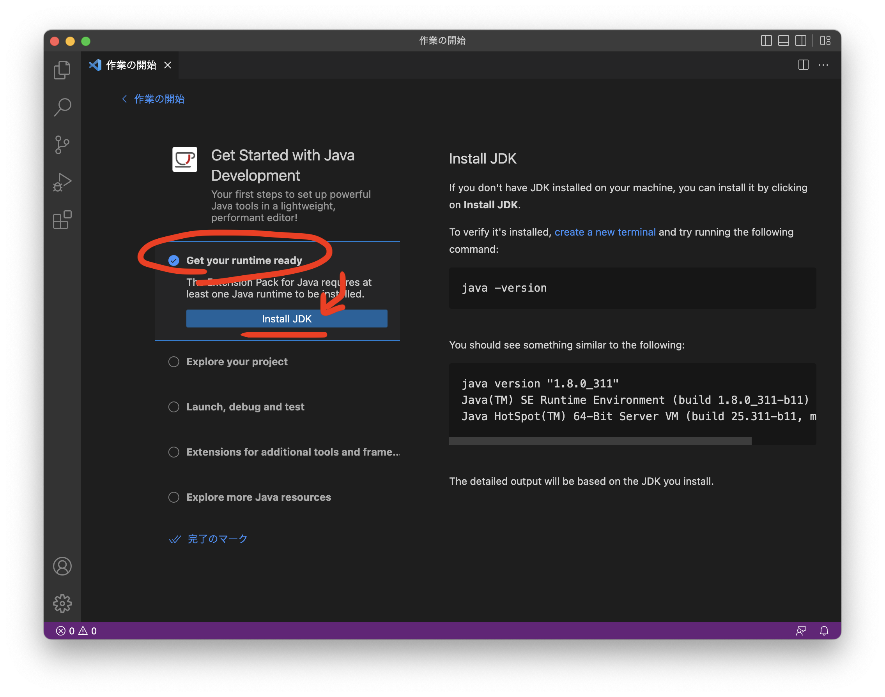
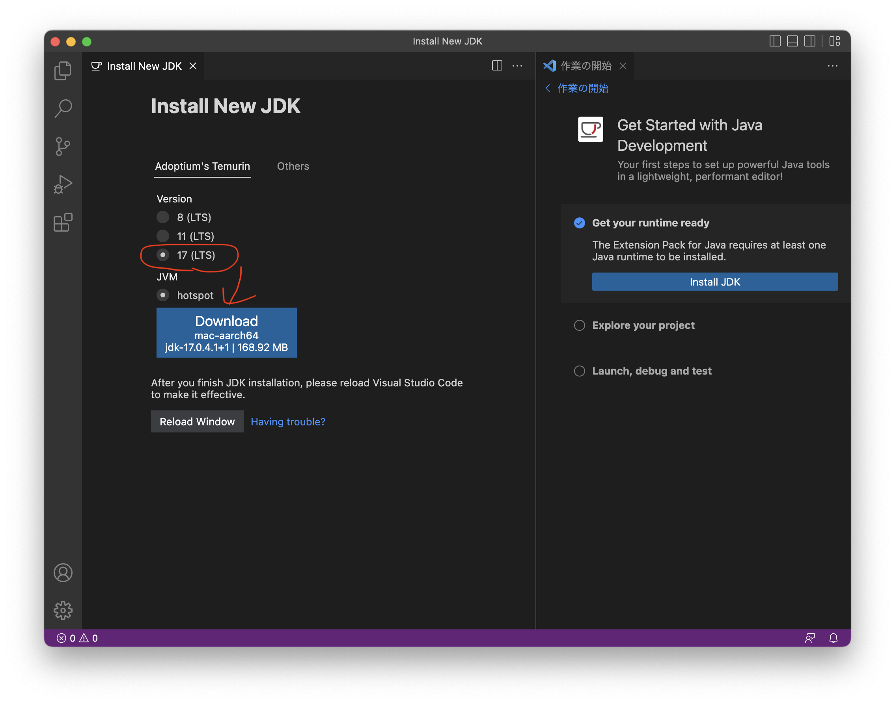
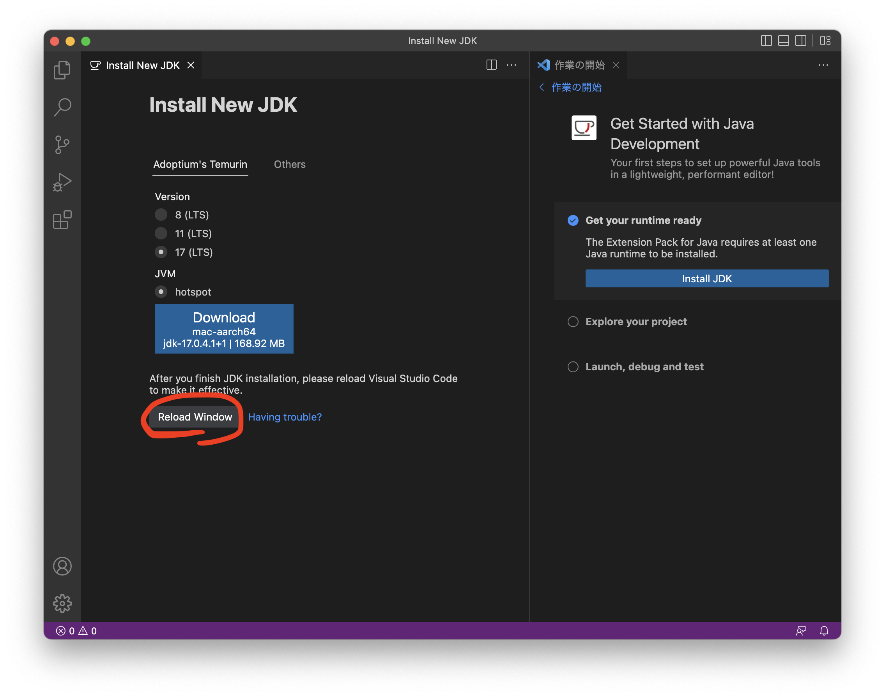

# VSCodeの環境構築

- ＜目次＞
  - <a href="#step0">想定環境</a>
  - <a href="#step1">Step 1. VSCodeを最新版に更新する。</a>
  - <a href="#step2">Step 2. VSCodeからOpenJDKのインストール。</a>
  - <a href="#step3">Step 3. VSCodeの設定（OpenJDKのための設定）。</a>

---
## <a name="step0">想定環境</a>
- 動作確認日: 2022/9/6
- MacBook Air (M1, 2020)
- macOS Monterey 12.5.1
- Apple Silicon版VSCodeインストール済み。
- JDK未インストール。
- 備考
  - 再履修生等、既にJDKを用いた開発できる環境構築済みならそれを利用して構わない。ただし授業ページでは VSCode, OpenJDK 16, Gradle, JUnit 5, Git, GitHub 前提で書いてあるため、適宜手順等を読み替えて対応すること。

---
## <a name="step1">Step 1. VSCodeを最新版に更新する。</a>
VSCodeを起動し、``Code``メニューから``更新を確認``し、最新版に更新しよう。

2022年9月6日時点での最新版は 1.71.0。

---
## <a name="step2">Step 2. VSCodeからOpenJDKのインストール。</a>
VSCodeが何かしら過去コードを開いているならばそのウィンドウを閉じ、``ファイル``メニューから``新規ウィンドウ``を選ぼう。



上図の通り、新規ウィンドウには「作業の開始」が開いているはずだ。ここから右下の「その他」をクリックしよう。
- **「その他」が出てこない場合**。（出てくる場合はこのサブツリーは無視して、次の画面に移動してください）
  - 左下の歯車アイコンクリックして、「拡張機能(Extension)」を選択。
  - 検索窓に「java」と入力して「Extension Pack for Java」を探す。見つかったら選択して、インストール。
  - インストール終わったらVSCodeを再起動。
  - ``⌘ + Shift + P`` を押してコマンドパレットを開き、``java``と入力。そこから``Java: Configure Java Runtime`` を選ぼう。選んだら<a href="#configure">configure画面</a>から続けよう。



その他をクリックすると、上図の通り画面上部のコマンドパレットに選択肢が列挙される。これをスクロールして、``Get Started with Java Development`` を選択しよう。

---



Get Started with Java Development画面に移動したら、「Get your Java runtime ready」にチェックを入れ、``Install JDK`` をクリックしよう。

---

<a name="configure"></a>


上図画面になったら、「17 (LTS)」にチェックを入れ、``Download`` をクリックしよう。ブラウザが立ち上がり、ダウンロードページに遷移するので、そこからOpenJDK 16をダウンロードしよう。ファイルサイズは約200MBあるのでダウンロード完了するまで待とう。

JDKをダウンロードすると、ダウンロードフォルダの中に ``OpenJDK17U-jdk_aarch64_mac_hotspot_17.0.4.1_1.pkg`` のようなファイルが保存されているはずだ。これをダブルクリックし、指定手順通りにインストールをしよう。特に変更する箇所はなく、デフォルトのままで良い。

インストールを終えたら、ターミナルを開いて ``java --version`` と実行してみよう。以下のようにバージョンを確認することができればOK。
```
oct:tnal% java -version
openjdk version "17.0.4.1" 2022-08-12
OpenJDK Runtime Environment Temurin-17.0.4.1+1 (build 17.0.4.1+1)
OpenJDK 64-Bit Server VM Temurin-17.0.4.1+1 (build 17.0.4.1+1, mixed mode)
```

---
## <a name="step3">Step 3. VSCodeの設定（OpenJDKのための設定）。</a>



OpenJDKをインストールし終えたら、上図の通りVSCodeをReloadしよう。

次に、動作確認をしていこう。授業では ``~/prog2/`` をプログラミング2用のディレクトリとして利用するものとする。また、今回の動作確認では ``~/prog2/sample/`` というプロジェクトを用意し、その中にソースファイルを用意して実行するものとする。

**【注意点】**
- Pythonと異なり、Javaでは「プロジェクト」という単位で開発を行う。これは「課題1用のプロジェクト」「演習3用のプロジェクト」といったように、専用のプロジェクトを用意して作業することを意味している。プロジェクトごとに異なるディレクトリを用意することになるため、これらのプロジェクトがPC内のあちこちに散らばってしまうと不便だ。授業ではそれをまとめるための「プログラミング2用のディレクトリ」として ``~/prog2/`` を用意し、その中にプロジェクトごとのディレクトリを用意することとする。

それでは、作業ディレクトリを用意(step3.1)し、その中に新規プロジェクトを作成(step3.2)して、動作確認(step3.3)してみよう。

- step 3.1: 作業ディレクトリの作成。
  - ターミナルを開いて ``~/prog2/`` を作成して下さい。
  - この作業は、今回限りです。次回以降（例えば課題や演習をやるとき）にはこのディレクトリはすでに存在してるため、2回目以降はやる必要はありません。
- step 3.2: 新規プロジェクトの作成。
  - ここでは ``sample`` という名前のプロジェクトを作成しよう。以下の作業は、新規プロジェクトを作成する都度繰り返し行うことになります。
  - (1) vscodeを立ち上げる。
  - (2) ``⌘ + Shift + P`` を押してコマンドパレットを開き、``java``と入力。そこから``Java: Create Java Project`` を選ぼう。
  - (3) プロジェクトの種類として、``No build tools`` を選ぼう。
  - (4) プロジェクトを保存する場所として ``~/prog2/`` を選ぼう。ここは誤解しやすいですが、プロジェクト名をここで選択しないようにしてください。
  - (5) プロジェクト名として ``sample`` を入力し、Enterキーを押す。
  - (6) サンプルコードの確認。
    - 自動的に「Hello, World!」と出力するだけのサンプルプログラムが作成されます。このときのファイル構成は以下のとおりです。この中の ``src/App.java`` を開いてください。
```
oct:tnal% pwd
/Users/tnal/prog2/sample
oct:tnal% tree
.
├── README.md
├── bin
│   └── App.class
├── lib
└── src
    └── App.java

3 directories, 3 files
```
  - (7) 動作確認。
    - Python同様、右上の ▷ ボタンを押して実行してみてください。ターミナル画面が現れ、そこに ``Hello, World!`` と出力されるならOKです。

---

## FAQ
- ターミナルで ``java --version`` と実行してもバージョンを確認できない。
  - case 1: JAVA_HOME の設定が必要かもしれません。今回のようにJDK17をインストールした場合、次のようにしてJAVAHOMEを設定してみてから再度実行してみてください。
```
cd
echo JAVA_HOME=/Library/Java/JavaVirtualMachines/temurin-17.jdk/Contents/Home >> .zshrc
source .zshrc
echo $JAVA_HOME
```

- ``~/prog2/sample/src/App.java`` を実行できない。
  - case 1: Java Classpath の設定が必要かもしれません。
    - App.javaを開いている状態で ``⌘ + Shift + P`` を押してコマンドパレットを開き、``java``と入力。そこから``Java: Configure Classpath`` を選ぼう。
    - JDK Runtime内の ``Configure Java Runtime`` をクリックしよう。
    - Java Versionのところから 17 を選ぶか、もしくはペンアイコンをクリックし、``/Library/Java/JavaVirtualMachines/temurin-17.jdk/Contents/Home`` を設定しよう。
    - 設定後、App.javaに戻り実行してみよう。
