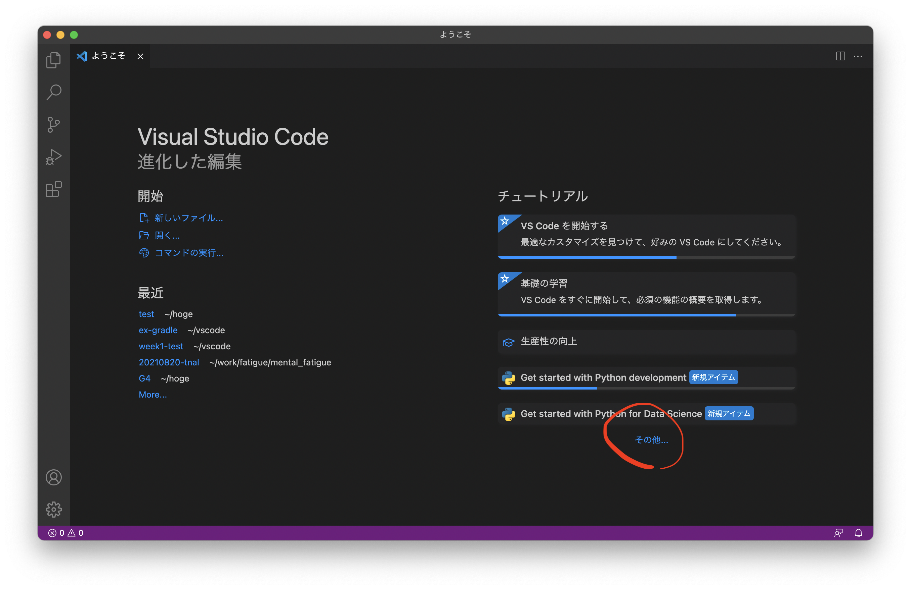
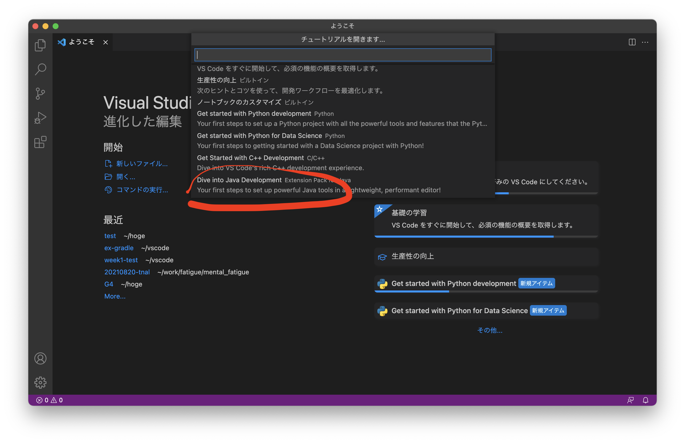
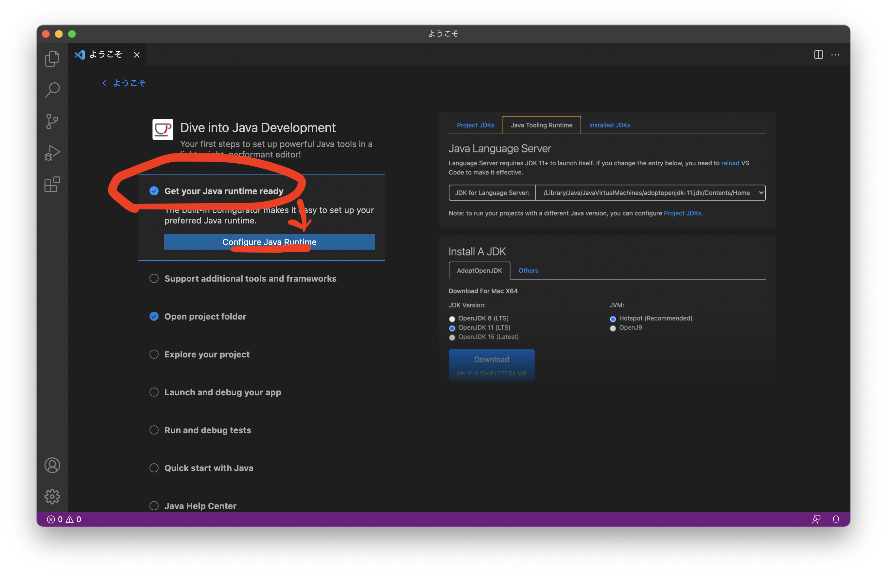
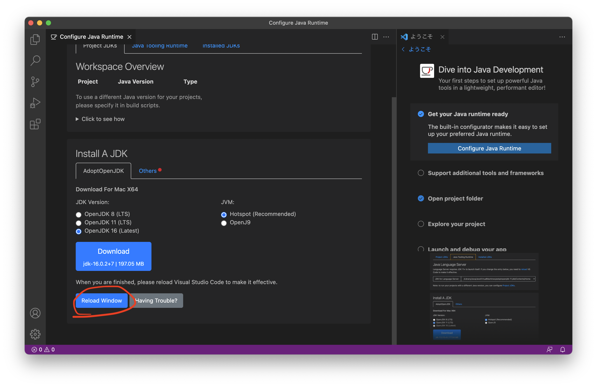
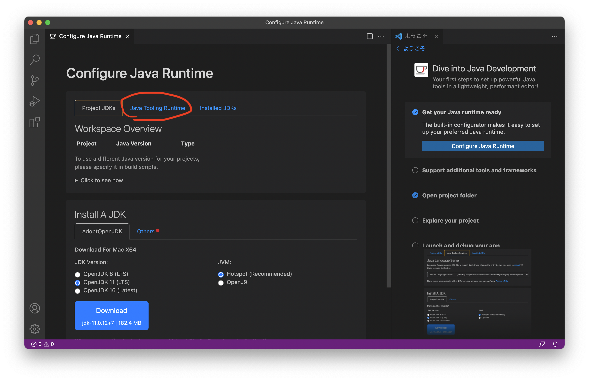
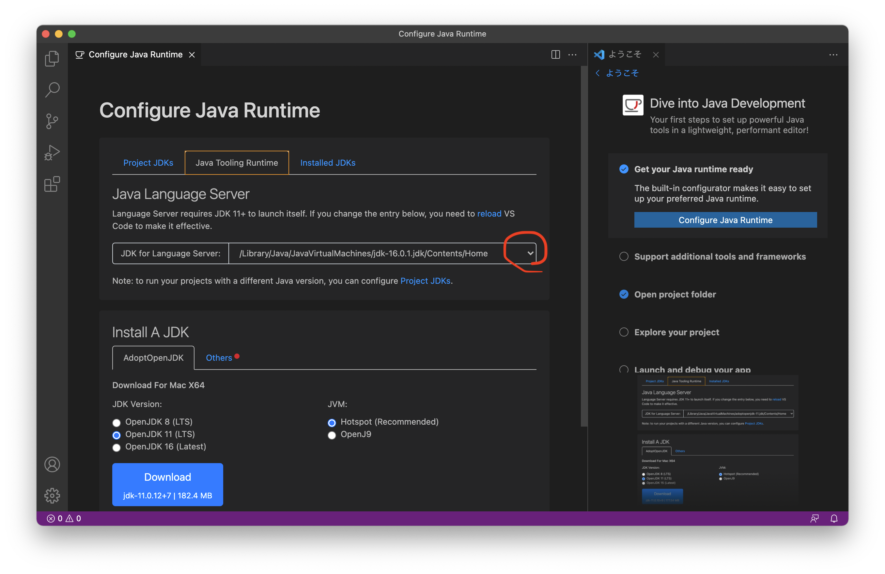
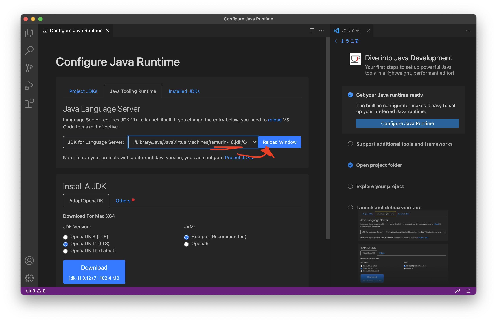

# VSCodeの環境構築

- ＜目次＞
  - <a href="#step0">想定環境</a>
  - <a href="#step1">Step 1. VSCodeを最新版に更新する。</a>
  - <a href="#step2">Step 2. VSCodeからOpenJDKのインストール。</a>
  - <a href="#step3">Step 3. VSCodeの設定（OpenJDKのための設定）。</a>
  - <a href="#step4">Step 4. Extension Pack for Javaをインストール。</a>

---
## <a name="step0">想定環境</a>
- 動作確認日: 2021/9/13
- MacBook Air (M1, 2020)
- macOS Big Sur 11.5.2
- Intel版VSCodeインストール済み。
- JDK未インストール。
- 備考
  - 再履修生等、既にJDKを用いた開発できる環境構築済みならそれを利用して構わない。ただし授業ページでは VSCode, OpenJDK 16, Gradle, JUnit 5, Git, GitHub 前提で書いてあるため、適宜手順等を読み替えて対応すること。

---
## <a name="step1">Step 1. VSCodeを最新版に更新する。</a>
VSCodeを起動し、``Code``メニューから``更新を確認``し、最新版に更新しよう。

2021年9月13日時点での最新版は 1.60.0。

---
## <a name="step2">Step 2. VSCodeからOpenJDKのインストール。</a>
VSCodeが何かしら過去コードを開いているならばそのウィンドウを閉じ、``ファイル``メニューから``新規ウィンドウ``を選ぼう。

上図の通り、新規ウィンドウには「ようこそ」が開いているはずだ。ここから右下の「その他」をクリックしよう。もし「その他」が出てこないなら、``⌘ + Shift + P`` を押してコマンドパレットを開き、``java``と入力。そこから``Java: Configure Java Runtime`` を選ぼう。選んだら<a name="#configure">configure画面</a>から続けよう。

その他をクリックすると、上図の通り画面上部のコマンドパレットに選択肢が列挙される。これをスクロールして、``Dive into Java Development`` を選択しよう。

Dive into Java Development画面に移動したら、「Get your Java runtime ready」にチェックを入れ、``Configure Java Runtime`` をクリックしよう。

上図画面になったら、「OpenJDK 16 (Latest)」にチェックを入れ、``Download`` をクリックしよう。ブラウザが立ち上がり、ダウンロードページに遷移するので、そこからOpenJDK 16をダウンロードしよう。ファイルサイズは約200MBあるのでダウンロード完了するまで待とう。

JDKをダウンロードすると、ダウンロードフォルダの中に ``OpenJDK16U-jdk_x64_mac_hotspot_16.0.2_7.pkg`` のようなファイルが保存されているはずだ。これをダブルクリックし、指定手順通りにインストールをしよう。特に変更する箇所はなく、デフォルトのままで良い。

---
## <a name="step3">Step 3. VSCodeの設定（OpenJDKのための設定）。</a>

OpenJDKをインストールし終えたら、上図の通りVSCodeをReloadしよう。

Reloadし終えると上記画面になるため、``Java Tooling Runtime`` を選択しよう。

インストールしたOpenJDKを選択するため、上図画面の赤丸で囲った箇所をクリックし、``/Library/Java/JavaVirtualMachines/temurin-16.jdk/Contents/Home`` を選択しよう。なお複数JDKをインストールしている環境では、``/Library/Java/JavaVirtualMachines/`` の下に複数JDKがインストールされているはずだ。今回はOpenJDKを選択するため``temurin-16.jdk``を選択しよう。

OpenJDK選択後に ``Reload`` するのを忘れずに。

下記は當間環境でOracle JDK 16, OpenJDK 16の2種類が入っており、OpenJDKへ変更した状況を例示している。OpenJDK 16(temurin-16.jdk)しかない場合にはそれで構わない。

---

## <a name="step4">Step 4. Extension Pack for Javaをインストール。</a>
- ``⌘⇧x`` を押して Extensions ビューを開く。
- 検索窓に ``java`` と入力。
- 検索結果をスクロールし、``Extension Pack for Java`` をインストールしよう。インストール済みならそのままでOK。
