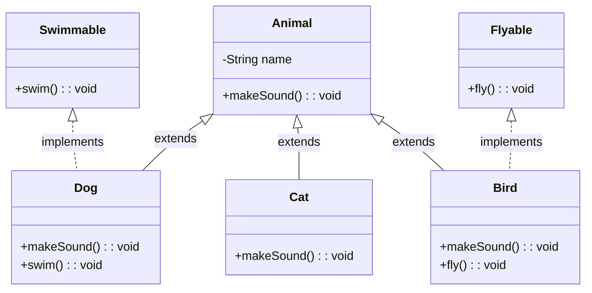

```mermaid
classDiagram
    class Animal {
      -String name
      +makeSound(): void
    }
    class Dog {
      +makeSound(): void
      +swim(): void
    }
    class Cat {
      +makeSound(): void
    }
    class Bird {
      +makeSound(): void
      +fly(): void
    }
    class Flyable {
      +fly(): void
    }
    class Swimmable {
      +swim(): void
    }

    Animal <|-- Dog : extends
    Animal <|-- Cat : extends
    Animal <|-- Bird : extends
    Flyable <|.. Bird : implements
    Swimmable <|.. Dog : implements
```

