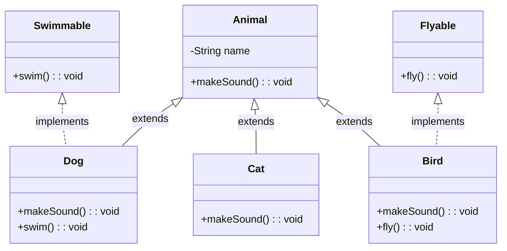
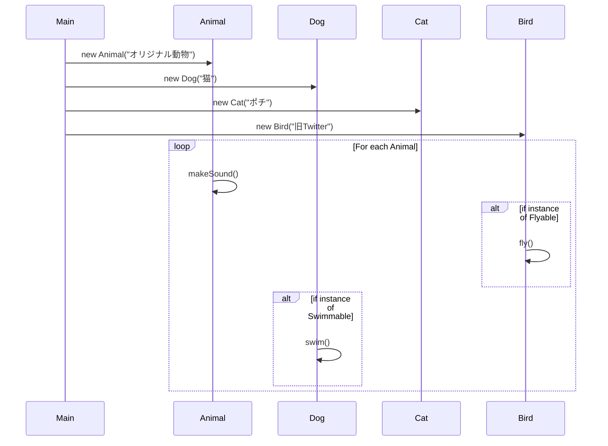

# 演習4: 継承とインタフェースを使ってみよう
以下のクラス図に相当するアプリケーションの実装を通して、継承とインタフェースの使い方の違いを体験してみましょう。



- [クラス図を別ウインドウで表示させたい人向けリンク](./ex4_classdiagram.md)

＜目次＞
- <a href="#policy">実装方針</a>
- <a href="#classdiagram">クラス図における箱の見方</a>
- <a href="#ex4_1">演習4.1: Gradleプロジェクトの作成。</a>
- <a href="#ex4_2">演習4.2: Animalクラスを実装しよう。</a>
- <a href="#ex4_3">演習4.3: Catクラスを実装しよう。</a>
- <a href="#ex4_4">演習4.4: Swimmableインタフェース、Dogクラスを実装しよう。</a>
- <a href="#ex4_5">演習4.5: Flyableインタフェース、Birdクラスを実装しよう。</a>
- <a href="#ex4_6">演習4.6: 多態性を利用しよう。</a>
- <a href="#uml">UML参考</a>

---
## <a name="policy">実装方針</a>
基本的な実装方針は以下のとおりです。

Animalが動物のためのスーパークラスであり、フィールドとして名前（name）を持ち、メソッドは鳴く（makeSound()）ことができます。

この Animal を継承して Dog、Cat, Bird といったサブクラスを実装していきます。ここで Dog は鳴くだけではなく泳ぐこともできるものとして実装しますが、単にメソッドを新規追加するのではなく「他にも泳げる動物がいるだろうからそれらをまとめたインタフェースとして Swimmable を用意し、具体的な泳ぐメソッド（swim()）をサブクラスで実装する」こととします。

同様に Bird は飛ぶことができますが、他にも飛ぶことができる動物がいるでしょう。このため飛ぶメソッド（fly()）を持つインタフェースを先に用意してやり、具体的な実装をサブクラスで行います。

クラス図内の四角形で表示されている部分をまとめると、Swimmable, Flyable の2つはインタフェース、それ以外はクラスとして実装することになります。

## <a name="classdiagram">クラス図における箱の見方</a>
各々の箱は2本の横線で区切られ、3区画で一つの箱を構成しています。この箱が1つのクラス（もしくはインタフェース）を表しています。他の箱とextendsで紐づいている場合にはクラス、implementsで紐づいている場合にはインタフェースです。

上から1段目（上段）はクラス名（インタフェース名）です。今回は Animal, Doc, Cat, Bird の4つのクラスと、Swimmable, Flyable の2つのインタフェースがあります。

2段目（中央）はフィールドです。例えば Animal クラスには ``-String name`` と書かれており、これは「privateなString型の変数name」があることを意味します（変数名と型を逆順に``-name: String``のように記述することもあります）。

冒頭の``-``は private であることを意味しています。他の記号は以下のとおりです。

| 記号 | 意味 |
| --- | --- |
| + | public |
| - | private |
| # | protected |

3段目（下段）はメソッドです。例えば Animal クラスには ``+makeSounds(): void`` と書かれており、これは「publicなメソッドmakeSound()は引数を取らず、戻り値はvoid型」であることを意味します。

多少書き方が代わることもありますが、上段中段下段の使い分けは必ず守るようにしましょう。

- 参考: [UMLリファレンス: 3.1.2. クラス図/class diagrams](https://lecture.ecc.u-tokyo.ac.jp/~hideo-t/references/uml/class-diagram/class-diagram.html)

## <a name="ex4_1">演習4.1: Gradleプロジェクトの作成。</a>
本演習で利用するためのGradleプロジェクトを作成してください。
- package として ex4 を指定すること。
- App.java, AppTest.java は不要なので削除すること。
- ``.gitignore `` に ``.DS_Store`` を追記し、バージョン管理対象外とすること。

上記までし終えたら、この状態（まだコードを書いていない状態）を初期バージョンとして登録しておこう（git add, commitしよう）。

また GitHub にベアリポジトリを用意し、pushしよう。

## <a name="ex4_2">演習4.2: Animalクラスを実装しよう。</a>
- クラス図を参照し、Animalクラスをパッケージ内に実装してください。
    - コンストラクタでは動物名（String）を受け取り、Animal.nameに保存すること。
    - Animal.nameを取得するための getter method を実装しておいてください。（クラス図にはこのような指定がありませんが、クラス図は全体像を俯瞰しやすくするためのものなので、細かな部分は省略して書くことが多いです）
    - makeSound() は、Animalクラスのメソッドを実行していることが分かるようなテキストを出力すること。
    - 例: Animal("Animal") としてオブジェクト生成した（名前をAnimalと名付けた）なら、「Animalが鳴いている」と出力する。
- Animal.makeSound() の動作を確認するために、パッケージ外に main メソッドを持つMainを用意し、オブジェクトを生成し、メソッドを実行できることを確認すること。
- ``gradle run`` でも Main.main を実行できるようにGradleを設定し、動作確認すること。
- 動作確認できたら、Animal.java, Main.java を git add, commit, push しよう。

## <a name="ex4_3">演習4.3: Catクラスを実装しよう。</a>
- クラス図を参照し、Catクラスをパッケージ内に実装してください。
    - CatクラスはAnimalクラスを継承して実装することになります（クラス図参照）。
    - makeSound() はoverrideで実装してください。Catクラスのメソッドを実行していることが分かるようなテキストを出力すること。
        - 例: 「(猫の名前)がにゃーと鳴いた」と出力する。
- Cat.makeSound() の動作を確認するために、パッケージ外にある Main.main 内でオブジェクトを生成し、メソッドを実行できること確認すること。
- gradle run でも動作確認すること。
- 動作確認できたら、Cat.java, Main.java を git add, commit, push しよう。

## <a name="ex4_4">演習4.4: Swimmableインタフェース、Dogクラスを実装しよう。</a>
- クラス図を参照し、Swimmableインタフェースをパッケージ内に用意してください。
    - swim() の中身を実装する必要はありませんが、このインタフェースの具体的な実装を小クラスに強制する必要があります。このために「swimメソッドは引数を取らず、戻り値もない」ということを記述しておいてください。
- クラス図を参照し、Dogクラスをパッケージ内に実装してください。
    - DogクラスはAnimalクラスを継承し、Swimmableインタフェースを実装する必要があります（クラス図参照）。
    - makeSound() はoverrideで実装してください。Catクラスのメソッドを実行していることが分かるようなテキストを出力すること。
        - 例: 「(犬の名前)がわんと鳴いた」と出力する。
    - swim() はoverrideで実装してください。Catクラスのメソッドを実行していることが分かるようなテキストを出力すること。
        - 例: 「(犬の名前)は泳いでいる」と出力する。
- Dog.makeSound(), Dog.swim() の動作を確認するために、パッケージ外にある Main.main 内でオブジェクトを生成し、メソッドを実行できること確認すること。
- gradle run でも動作確認すること。
- 動作確認できたら、Swimmable.java, Dog.java, Main.java を git add, commit, push しよう。

## <a name="ex4_5">演習4.5: Flyableインタフェース、Birdクラスを実装しよう。</a>
- クラス図を参照し、Flyableインタフェースをパッケージ内に用意してください。
    - fly() の中身を実装する必要はありませんが、このインタフェースの具体的な実装を小クラスに強制する必要があります。このために「flyメソッドは引数を取らず、戻り値もない」ということを記述しておいてください。
- クラス図を参照し、Birdクラスをパッケージ内に実装してください。
    - BirdクラスはAnimalクラスを継承し、Flyableインタフェースを実装する必要があります（クラス図参照）。
    - makeSound() はoverrideで実装してください。Birdクラスのメソッドを実行していることが分かるようなテキストを出力すること。
        - 例: 「(鳥の名前)がチュンチュンと鳴いた」と出力する。
    - fly() はoverrideで実装してください。Birdクラスのメソッドを実行していることが分かるようなテキストを出力すること。
        - 例: 「(鳥の名前)はぱたぱたと飛んでいる」と出力する。
- Bird.makeSound(), Bird.fly() の動作を確認するために、パッケージ外にある Main.main 内でオブジェクトを生成し、メソッドを実行できること確認すること。
- gradle run でも動作確認すること。
- 動作確認できたら、Flyable.java, Bird.java, Main.java を git add, commit, push しよう。

## <a name="ex4_6">演習4.6: 多態性を利用しよう。</a>
以下のコードは多態性を利用し、複数の異なるクラスを同一ループ内の処理として記述しています。コードを読み、実際に実行してみて下さい。（理解することが目的です）

``instanceof`` は教科書479ページを参照ください。

```Java
public class Main {
    public static void main(String[] args) {
        Animal[] animals = new Animal[4];
        animals[0] = new Animal("オリジナル動物");
        animals[1] = new Dog("猫");
        animals[2] = new Cat("ポチ");
        animals[3] = new Bird("旧Twitter");

        for (Animal animal : animals) {
            animal.makeSound();
            if (animal instanceof Flyable) {
                ((Flyable) animal).fly();
            }
            if (animal instanceof Swimmable) {
                ((Swimmable) animal).swim();
            }
        }
    }
}
```

## <a name="uml">UML参考</a>
上記のmainメソッドの手続きをシーケンス図として書くと以下のようになります。この演習で用いているクラス図やシーケンス図は UML に基づく設計図です。興味のある人は[3.1. UMLレファレンス/Unified Modeling Language(UML) reference](https://lecture.ecc.u-tokyo.ac.jp/~hideo-t/references/uml/index.html)を参考にしてみてください。



## コード例
https://github.com/naltoma/prog2_2023_ex4
