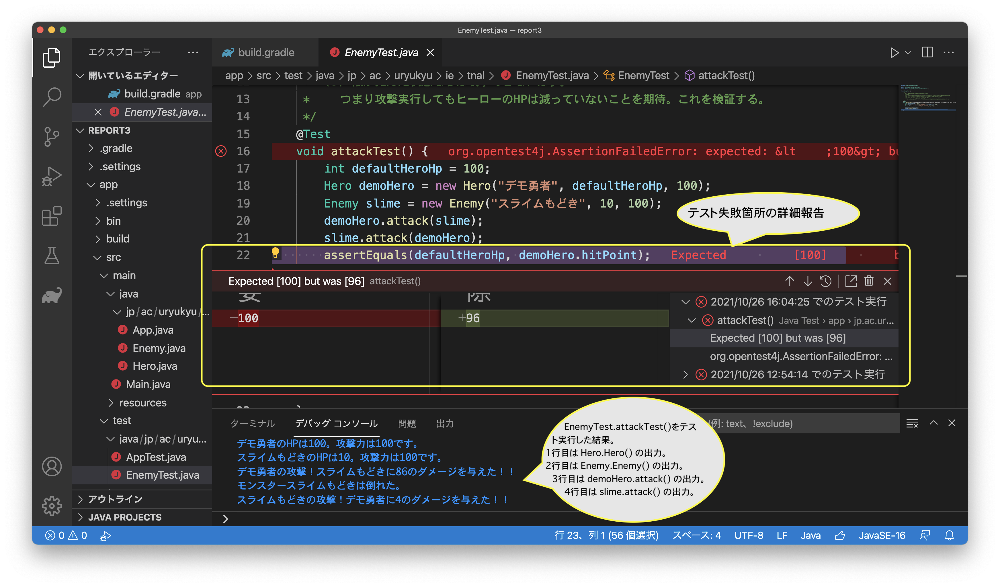

# 課題レポート3: リファクタリングを通してユニットテストとバージョン管理に慣れよう

- 前期からの変更点
  - 課題説明は「課題概要」のみで十分です。
  - 今回のレポート3についても「最大3ページ」に収めるようにして下さい。
    - ソースファイルも提出してもらうので、レポートに全コードコピペ掲載する必要はありません。特に工夫した点のみを掲載した上で解説・考察しよう。

- ＜目次＞
- <a href="#abst">課題概要</a>
- <a href="#details">詳細仕様</a>
  - <a href="#details_step1">ステップ1: コードの準備。</a>
  - <a href="#details_step2">ステップ2: 死亡した後で攻撃できてしまう件をどうにかしたい。</a>
  - <a href="#details_step3">ステップ3: カプセル化しよう。</a>
  - <a href="#details_step4">(おまけ)ステップ4: アクセサのJavaDocを書こう。</a>
- <a href="#report">取り組み方、レポートに含めるべき項目</a>
- <a href="#submit">提出方法</a>

<hr>

## <a name="abst">課題概要</a>
- コード例[ex-gradle](https://github.com/naltoma/ex-gradle)は、ターン制バトルゲーム（1ターン毎に勇者とスライムが戦い、どちらかが倒れるまで攻撃し合う）を書いている途中だ。ただし次に示す問題があるため、修正したい。ユニットテストとバージョン管理システムを使いながら、一歩ずつリファクタリングしてみよう。
  - 状況：各ターンではまず勇者が敵を攻撃し、ダメージに応じてスライムのHPを修正する。次にスライムが勇者を攻撃し、勇者のHPを修正する。これを繰り返すが、どちらかが倒れたらループを抜ける。
  - 問題：勇者がスライムを倒しても、スライムが勇者を攻撃できてしまう。
- 問題を確認するテストコード(EnemyTest.java)。
  - 次の手順で問題の有無を確認している。
    - (1) ヒーローと敵を準備。ヒーローの攻撃力は敵を一撃で倒せるほど強い状態とする。具体的にはヒーローの攻撃力を100とし、スライムのHPを10とする。
    - (2) ヒーローが殴り、敵も殴る。敵は一撃で倒されていることを期待。実際には乱数を用いているためたまたま倒れないこともあるが、殆どの場合で即死ダメージを与える。
    - (3) 敵が死んだ状態ならば攻撃できないはず。つまり攻撃実行してもヒーローのHPは減っていないことを期待する。この期待通りになるかどうかをコードで検証する。
      - 初期HPを保存している変数（defaultHeroHp）と、殴られた後のデモ勇者のHP（demoHero.hitPoint）とが等しいならば、減っていないと見做せる。
- テストコードによる動作確認。
  - 
  - 上記は以下のことを確認している。
    - 17行目: デモ勇者の初期HPを覚えておくための変数。100に設定。
    - 18行目: デモ勇者のインスタンスを生成。第1引数は勇者名。第2引数はHP。第3引数は攻撃力。
    - 19行目: スライムもどきのインスタンスを生成。第1引数はモンスター名。第2引数はHP。第3引数は攻撃力。デモ勇者の攻撃力より圧倒的に低いため、殴られたら即死するだろう（極稀に生き残ることはある）。
    - 20行目: デモ勇者がスライムもどきに攻撃。
    - 21行目: スライムもどきがデモ勇者に攻撃。スライムもどきが20行目で倒れているなら、この攻撃は実行されないはず。
    - 22行目: デモ勇者の初期HPと現HPが等しいことを検証。
      - 実行結果は ``Expected [100] but was [96]`` となっている。これは「100を期待していたが、96になっている（ため失敗）」であることを意味する。倒れた後に攻撃できてしまっていることを修正したい。

<hr>

## <a name="details">詳細仕様</a>
### <a name="details_step1">ステップ1: コードの準備。</a>
- (a) 新規プロジェクトを Gradle で用意しよう。
  - プロジェクト名は自由で良い。以下の例では ``~/prog2/report3`` とする。
  - まずGradleをインストールする。
    - ターミナルで ``brew install gradle`` を実行。
    - インストール終了後、``gradle --version`` でバージョン確認し、7.2以降になっていればOK。
  - プロジェクトの用意。
    - mkdir で ``~/prog2/report3`` フォルダを作成し、ターミナルで移動。
    - ``~/prog2/report3/`` にいる状態で、ターミナルで ``gradle init`` を実行。
      - [ここのstep 2: Gradleの初期設定](https://github.com/naltoma/java_intro2020/blob/master/Gradle.md#step2)を参考に、プロジェクトを用意。何をやっているのかは次週授業で説明します。
- (b) サンプルコードの準備。
  - [ex-gradle](https://github.com/naltoma/ex-gradle)を参考に、Hero.java, Enemy.java, Main.java, EnemyTest.java の4つを適切に配置するために下記コマンドを実行しよう。**なお、mvコマンドではパッケージ名を指定してファイルを移動しているため、``tnal`` を ``自身のアカウント`` に修正して実行すること。**

    ```shell
    # ~/prog2/report3 に移動し、
    # gradle init した後で実行することを想定。

    curl -O https://raw.githubusercontent.com/naltoma/ex-gradle/main/app/src/main/java/Main.java
    mv Main.java app/src/main/java/
    curl -O https://raw.githubusercontent.com/naltoma/ex-gradle/main/app/src/main/java/jp/ac/uryukyu/ie/tnal/Enemy.java
    mv Enemy.java app/src/main/java/jp/ac/uryukyu/ie/tnal/
    curl -O https://raw.githubusercontent.com/naltoma/ex-gradle/main/app/src/main/java/jp/ac/uryukyu/ie/tnal/Hero.java
    mv Hero.java app/src/main/java/jp/ac/uryukyu/ie/tnal/
    curl -O https://raw.githubusercontent.com/naltoma/ex-gradle/main/app/src/test/java/jp/ac/uryukyu/ie/tnal/EnemyTest.java
    mv EnemyTest.java app/src/test/java/jp/ac/uryukyu/ie/tnal/
    ```
  - 上記コマンドがやっている内容は、具体的には以下の通り。
    - 指定したパッケージの下に [Hero.java](https://github.com/naltoma/ex-gradle/blob/main/app/src/main/java/jp/ac/uryukyu/ie/tnal/Hero.java), [Enemy.java](https://github.com/naltoma/ex-gradle/blob/main/app/src/main/java/jp/ac/uryukyu/ie/tnal/Enemy.java) を用意する。
      - なお、Gradleプロジェクトの場合には階層構造が以下のようになる。
        - ``プロジェクト名/app/src/main/java/パッケージ名/Hero.java``
        - ``プロジェクト名/app/src/main/java/パッケージ名/Enemy.java``
    - パッケージ外に [Main.java](https://github.com/naltoma/ex-gradle/blob/main/app/src/main/java/Main.java) を用意する。
      - ``プロジェクト名/app/src/main/java/Main.java``
    - test以下に [EnemyTest.java](https://github.com/naltoma/ex-gradle/blob/main/app/src/test/java/jp/ac/uryukyu/ie/tnal/EnemyTest.java) を用意する。
      - ``プロジェクト名/app/src/test/java/パッケージ名/EnemyTest.java``
- (c) ソースコードの修正。
  - ``app/src/main/java/jp/ac/uryukyu/ie/tnal/Enemy.java`` のパッケージ名を変更。
    - tnal から自身のアカウントに変更しよう。
  - ``app/src/main/java/jp/ac/uryukyu/ie/tnal/Hero.java`` のパッケージ名を変更。
    - 同上。
  - ``app/src/main/java/Main.java``
    - importしてるパッケージ名を変更。
- (d) ``app/build.gradle`` を編集。
  - 29行目を ``mainClass = 'Main'`` に書き換えよう。
  - 書き換えたら、ファイルを保存しよう。
  - ``A build file was modified. Do you want to synchronize the Java classpath/configuration?`` というダイアログが出力されたら、Now もしくは Always を選択。これは設定変更を反映するかどうかを尋ねている。
- (e) 動作確認1：**通常実行**。
  - VSCodeからの動作確認。
    - ``app/src/main/java/Main.java`` を実行せよ。乱数を用いたコードなので実行する毎に動作が異なるが、おおよそ以下のような出力が得られるはずだ。

      ```shell
      oct2021:tnal%  /usr/bin/env /Library/Java/JavaVirtualMachines/temurin-16.jdk/Contents/Home/bin/java -XX:+ShowCodeDetailsInExceptionMessages -Dfile.encoding=UTF-8 @/var/folders/nc/_3k6g05j2499x9n2cjtmhxl80000gn/T/cp_38yuv65uwamxn1u85h7y9rq4h.argfile Main
      勇者のHPは10。攻撃力は5です。
      スライムのHPは6。攻撃力は3です。
      勇者 vs. スライム
      1ターン目開始！
      勇者の攻撃！スライムに1のダメージを与えた！！
      スライムの攻撃！勇者に0のダメージを与えた！！
      2ターン目開始！
      勇者の攻撃！スライムに0のダメージを与えた！！
      スライムの攻撃！勇者に2のダメージを与えた！！
      3ターン目開始！
      勇者の攻撃！スライムに3のダメージを与えた！！
      スライムの攻撃！勇者に2のダメージを与えた！！
      4ターン目開始！
      勇者の攻撃！スライムに0のダメージを与えた！！
      スライムの攻撃！勇者に1のダメージを与えた！！
      5ターン目開始！
      勇者の攻撃！スライムに2のダメージを与えた！！
      スライムの攻撃！勇者に2のダメージを与えた！！
      6ターン目開始！
      勇者の攻撃！スライムに1のダメージを与えた！！
      モンスタースライムは倒れた。
      スライムの攻撃！勇者に2のダメージを与えた！！
      戦闘終了
      oct2021:tnal%  
      ```

  - Gradleからの確認。
    - ターミナル上で ``gradle run`` と実行すると、Main.javaを実行してくれる。

      ```shell
      oct2021:tnal% gradle run

      > Task :app:run
      勇者のHPは10。攻撃力は5です。
      スライムのHPは6。攻撃力は3です。
      勇者 vs. スライム
      1ターン目開始！
      勇者の攻撃！スライムに1のダメージを与えた！！
      スライムの攻撃！勇者に0のダメージを与えた！！
      2ターン目開始！
      勇者の攻撃！スライムに4のダメージを与えた！！
      スライムの攻撃！勇者に0のダメージを与えた！！
      3ターン目開始！
      勇者の攻撃！スライムに4のダメージを与えた！！
      モンスタースライムは倒れた。
      スライムの攻撃！勇者に0のダメージを与えた！！
      戦闘終了

      BUILD SUCCESSFUL in 1s
      2 actionable tasks: 2 executed
      oct2021:tnal% gradle test
      ```

- (f) 動作確認2：**テスト実行**。
  - VSCodeからの動作確認。
    - ``app/src/test/java/jp/ac/uryukyu/ie/tnal/EnemyTest.java`` を実行しよう。テストを実行するには、EnemyTest.javaを開き、6行目``class EnemyTest``の行番号の隣にある▷アイコンを押すと、このクラス内にあるテストメソッドをすべて実行してくれる。
    - 課題概要で示したようにテストが失敗することを確認しよう。乱数を用いているため具体的な数値は異なっていも問題ない。
  - Gradleからの動作確認。
    - ターミナルで ``gradle test`` を実行しよう。同様にテストが失敗することを確認しよう。
- (g) 動作確認後、GitHubリポジトリにpushせよ。
  - 自動生成されるファイル(``app/build/以下``)はaddしないこと。
- レポート報告事項
  - ステップ1に関しては、pushしたリポジトリURL（Git URL）を報告するだけで良い。なお、ステップ2以降でコードが修正されていくが、一度pushした版は過去に遡って参照できる（確認してみよう）ので、上書きされてしまうことは気にしなくて良い。

<hr>

### <a name="details_step2">ステップ2: 死亡した後で攻撃できてしまう件をどうにかしたい。</a>
- EnemyTestのattack()では、enemy.deadがtrueの時、すなわちenemyが死亡している時に攻撃できてしまうことを検証している。
  - Enemy.javaのattack()だけを修正し、「enemy自身が死亡している状態では攻撃できない」ようにせよ。他クラスやメソッドは変更しないこと。
    - ここで「攻撃できない」とは、相手のHPが減らないこととする。
  - 死亡時に攻撃できないようになれば、EnemyTest.attack()のテストは成功するはずである。テストが成功したら、commit & push せよ。
- レポート報告事項
  - Enemy.attack()の差分コードを以下の手順で掲載し、どのように修正したのか解説せよ。
    - 差分コードの出力手順
      - ターミナルでプロジェクトを保存しているディレクトリに移動する。（例の通りなら ~/prog2/report3/ 以下にあるはず）
      - ``git log -p -1`` を実行し、直近1つのコミットでの変更点を出力させる。この実行結果全体をレポートに含めよう。（このコマンドの意味は[前期資料](https://github.com/naltoma/python_intro/blob/master/Git.md)で確認しよう。）
  - 想定: 数行の追加で終わるはず。

<hr>

### <a name="details_step3">ステップ3: カプセル化しよう。</a>
- Hero, Enemyクラスのフィールド変数（String name, int hitPoint, int attack, boolean dead）は全てpublicになっている。勝手に他のクラスから修正されると困るため、これらをカプセル化しよう。
  - 上記4変数を private にしよう。
  - フィールド変数を参照・設定するためのアクセサ（getter/setter method）も用意しよう。
  - この隠蔽化に伴い、直接フィールド変数へアクセスしている箇所でエラーが起きるはずだ。エラーが起きた箇所を、アクセサを利用することで修正しよう。
  - MainクラスとEnemyTestクラスが正常動作することを確認できたら、commit & push しよう。
- レポート報告事項
  - コード掲載は不要である。今回の修正を通して気づいた点を報告せよ。

<hr>

### <a name="details_step4">(おまけ)ステップ4: アクセサのJavaDocを書こう。</a>
- 授業で示したJavaDoc例を元に、ステップ3で追加したメソッドのドキュメントをJavaDoc形式で書こう。
  - 記述したらHTMLドキュメントを生成し、想定通りに反映されていることを確認すること。
  - 確認できたらJavaのソースファイルだけをpushしよう。ドキュメントは自動生成できるので含めなくて良い。
- レポート報告事項
  - HeroもしくはEnemyどちらかのHTMLドキュメントをブラウザで参照した際の画面キャプチャを含めよ。

<hr>

## <a name="report">取り組み方、レポートに含めるべき項目</a>
- ペアや友人らと話し合って取り組んで構わないが、コード解説を加えるなど「自分自身の報告書」となるように取り組むこと。試して分かったこと、自身で解決できなかった部分等についてどう取り組んだか、といった過程がわかるように示すこと。（考えを図表や文章を駆使して表現して報告する練習です）
- レポート作成は好きなツール（ソフトウェア）を使って構わない。ただし下記を含めること。
  - タイトル
    - 今回は「**プログラミング2、レポート課題3: 「リファクタリングを通してユニットテストとバージョン管理に慣れよう」**」。
  - 提出日: yyyy-mm-dd
  - 報告者: 学籍番号、氏名
    - 複数人で相談しながらやった場合、相談者らを「**協力者: 学籍番号、氏名**」として示そう。
  - 課題説明（概要のみでOK）
  - **Step 1について**
    - pushしたリポジトリURL（Git URL）を報告すること。
  - **Step 2について**
    - 指定手順で得られる EnemyTest.attack()の差分コードを掲載し、どのように修正したのか解説せよ。
  - **Step 3について**
    - 今回のコード修正を通して、気づいたことを報告せよ。
  - **Step 4について**
    - キャプチャ画像を掲載せよ。
  - その他
    - 通常は感想等をレポートには含めませんが、練習なので課題に取り組みながら何か感じたこと、悩んでいること等、書きたいことがあれば自由に書いてください。（なければ省略OK）

<hr>

## <a name="submit">提出方法</a>
- 提出物は「レポート」の1点である。
  - ソースファイルの提出は不要。（GitHubで確認します）
- レポートは電子ファイルで提出するものとする。
- 提出先:
  - Google ドキュメントのreport3。
- 締切: 調整中。
